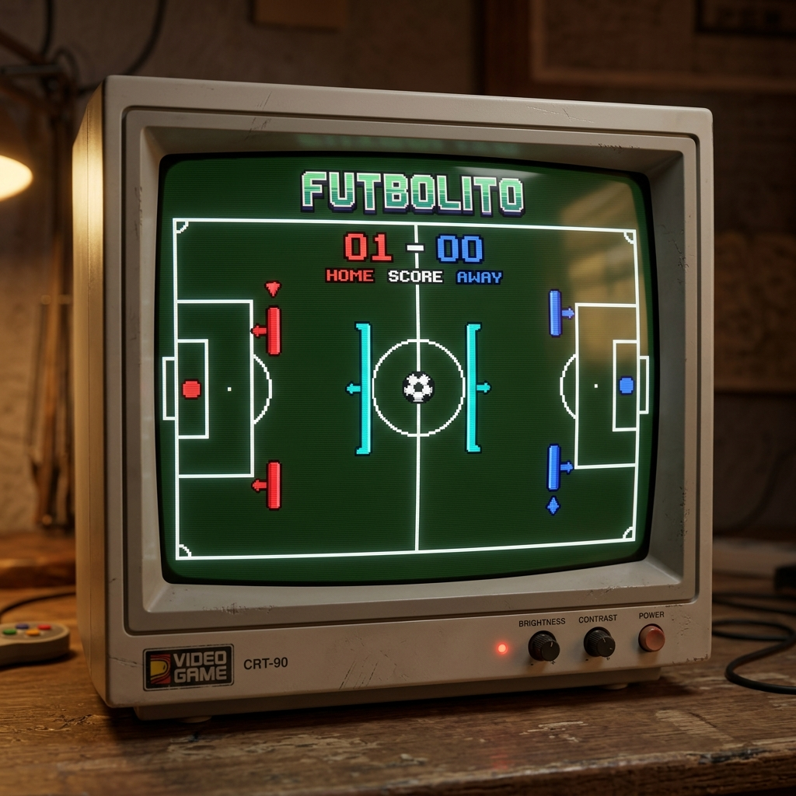
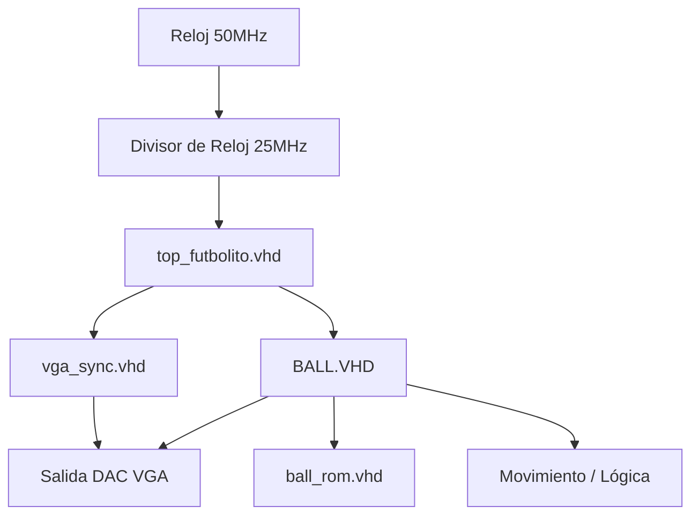

# Diseño e Implementación de un Sistema de Videojuego "Futbolito" sobre FPGA

**Presentado por:** [Tu Nombre]
**Asesor:** [Nombre del Asesor]
**Plataforma:** Intel Altera Cyclone IV (DE2-115)

---

## Introducción

El proyecto consiste en el diseño de un sistema basado en hardware para la ejecución de un juego de Futbolito interactivo.

### Objetivos:
- Implementación de un **controlador de video VGA**.
- Gestión de **gráficos en tiempo real** mediante sprites.
- Lógica de juego con **física de colisiones** y sistema de puntuación.
- Optimización de recursos de hardware en FPGA.

---

## Arquitectura del Proyecto

El sistema está dividido en módulos jerárquicos escritos en VHDL:

---

## Sincronización de Video (VGA)

Se utiliza el estándar **640x480 @ 60 Hz**.

- **Reloj de Píxel:** 25.175 MHz (aproximado a 25 MHz).
- **Entidad:** `vga_sync.vhd` / `top_futbolito.vhd`.
- **Funcionamiento:**
    - Contadores horizontal (`h_count`) y vertical (`v_count`).
    - Generación de pulsos `HSync` y `VSync`.
    - Señal `video_on` para delimitar el área visible.

---

## Generación de Gráficos: Capas

El dibujo se realiza mediante condiciones de prioridad dentro del proceso de video:

1. **Fondo:** Campo verde con líneas blancas (porterías, medio campo).
2. **Jugadores:** 
   - Porteros (Rojo/Azul).
   - Defensas (Cyan).
3. **Balón:** Carga de sprite desde ROM.
4. **HUD:** Marcador en LEDs y texto "GAME OVER".

---

## Lógica del Juego: Movimiento y Colisiones

Implementado en un proceso sensible a la sincronía vertical (`Vert_sync`):

- **Física de la Pelota:** 
  - Reflexión en bordes superior e inferior.
  - Detección de colisión con barras (`collide_left`, `collide_right`).
- **Control de Usuario:** Entradas mediante botones (`BTN_UP`, `BTN_DOWN`) para mover las paletas.
- **Detección de Gol:** Cuando la pelota cruza el plano X del fondo fuera de la zona de rebote.

---

## Sistema de Sprites y ROM

Para el balón se utiliza un **sprite de 16x16 píxeles**:

- **Origen:** Imagen PNG convertida mediante script Python (`img_to_vhdl.py`).
- **Almacenamiento:** Módulo `ball_rom.vhd` (256 palabras x 4 bits).
- **Formato:** Bits de color (RGB) + Bit de transparencia (Alpha).

> "El uso de ROMs permite una mayor fidelidad visual sin sobrecargar la lógica combinacional de la FPGA."

---

## Conclusiones

- **Sincronismo:** El manejo preciso de tiempos es crítico para una visualización estable.
- **Modularidad:** El diseño top-down facilita el debug de colisiones y lógica.
- **Eficiencia:** El uso de Python para assets (`MIF/VHDL`) agiliza el flujo de diseño.

---

# ¿Preguntas?

**¡Gracias por su atención!**
